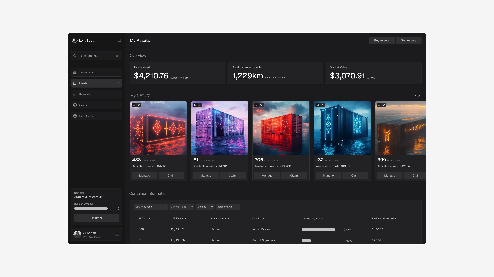
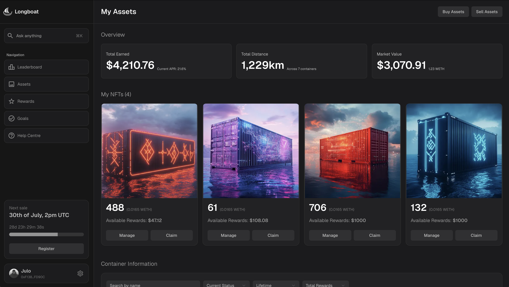

# Longboat Dashboard Concept

As part of improving my design engineering skills, I have designed and developed a dashboard concept for the RWA project Longboat (https://www.longboat.fi).

This project is built using:

- Next.js 15 with App Router (src folder)
- Tailwind v4
- Utilises Shadcn components in conjunction with custom code

## Design reference

This concept was originally designed within Figma: https://www.figma.com/design/qR9FRbZZZYKowOpG7JGijS/Longboat-fi-concept?node-id=0-1&t=vXGWtKSzd8f7YAdO-1

## Current build

Below is an image of the current build. This can also be viewed at: https://longboat-dashboard-concept.vercel.app

### Todos

- [ ] Fix mobile styling on dashboard
- [ ] Add in card carousel feature
- [ ] Clean up component structure